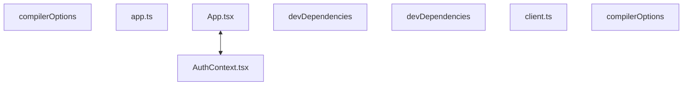

# Codebase Architectural Report

> **Auto-generated** by graphify knowledge graph analysis  
> **Purpose**: Dependency map, connection analysis, subsystem breakdown, and quality hotspots.

---

## 1. Executive Summary

- **Total Components**: `171`
- **Total Connections**: `197`
- **Subsystem Modules**: `1`
- **Dependency Types**: `9`

**Key Architectural Hubs:**

| # | Component | File | Type | Connections |
|---|-----------|------|------|-------------|
| 1 | `compilerOptions` | `frontend/tsconfig.json` | function | 14 |
| 2 | `app.ts` | `backend/src/app.ts` | file | 12 |
| 3 | `App.tsx` | `frontend/src/App.tsx` | class | 12 |
| 4 | `devDependencies` | `backend/package.json` | function | 11 |
| 5 | `devDependencies` | `frontend/package.json` | function | 10 |
| 6 | `client.ts` | `frontend/src/api/client.ts` | file | 9 |
| 7 | `AuthContext.tsx` | `frontend/src/auth/AuthContext.tsx` | class | 9 |
| 8 | `compilerOptions` | `backend/tsconfig.json` | function | 8 |

---

## 2. Dependency & Connection Analysis

### Relationship Types

| Relationship | Count | Share |
|-------------|-------|-------|
| `contains` | 99 | 50% |
| `imports` | 55 | 28% |
| `imports_from` | 24 | 12% |
| `calls` | 7 | 4% |
| `extends` | 6 | 3% |
| `method` | 3 | 2% |
| `indirect_call` | 1 | 1% |
| `references` | 1 | 1% |
| `conceptually_related_to` | 1 | 1% |

### Hub Dependency Diagram

### Most Connected Pairs

| Component A | Component B | Shared Connections |
|-------------|-------------|-------------------|
| `build` | `scripts` | 2 |
| `scripts` | `test` | 2 |
| `devDependencies` | `typescript` | 2 |
| `devDependencies` | `vitest` | 2 |
| `typescript` | `typescript` | 2 |
| `vitest` | `vitest` | 2 |
| `compilerOptions` | `esModuleInterop` | 2 |
| `compilerOptions` | `module` | 2 |
| `compilerOptions` | `skipLibCheck` | 2 |
| `compilerOptions` | `strict` | 2 |

---

## 3. Subsystem & Module Breakdown

### 3.1 frontend
**Nodes**: `171`  
**Files**: `backend/package.json`, `backend/src/app.ts`, `backend/src/config.ts`, `backend/src/db/database.ts`, `backend/src/index.ts`, `backend/src/middleware/auth.ts` +23 more

| Component | Type | File | Connections |
|-----------|------|------|-------------|
| `compilerOptions` | function | `frontend/tsconfig.json` | 14 |
| `app.ts` | file | `backend/src/app.ts` | 12 |
| `App.tsx` | class | `frontend/src/App.tsx` | 12 |
| `devDependencies` | function | `backend/package.json` | 11 |
| `devDependencies` | function | `frontend/package.json` | 10 |
| `client.ts` | file | `frontend/src/api/client.ts` | 9 |
| `AuthContext.tsx` | class | `frontend/src/auth/AuthContext.tsx` | 9 |
| `compilerOptions` | function | `backend/tsconfig.json` | 8 |
| `types.ts` | file | `frontend/src/types.ts` | 8 |
| `dependencies` | function | `backend/package.json` | 7 |

---

## 4. API Reference

Public classes and functions by subsystem.

### frontend

| Name | Type | File | Connections |
|------|------|------|-------------|
| `compilerOptions` | function | `frontend/tsconfig.json` | 14 |
| `App.tsx` | class | `frontend/src/App.tsx` | 12 |
| `devDependencies` | function | `backend/package.json` | 11 |
| `devDependencies` | function | `frontend/package.json` | 10 |
| `AuthContext.tsx` | class | `frontend/src/auth/AuthContext.tsx` | 9 |
| `compilerOptions` | function | `backend/tsconfig.json` | 8 |
| `dependencies` | function | `backend/package.json` | 7 |
| `AuthService` | class | `backend/src/modules/auth/auth.service.ts` | 6 |

---

## 5. Code Quality & Architectural Risk Hotspots

### Component Type Distribution

| Type | Count | Share |
|------|-------|-------|
| function | 110 | 64% |
| class | 32 | 19% |
| file | 16 | 9% |
| method | 13 | 8% |

### Dependency Cycles

**42** circular dependency loop(s) detected:

| # | Cycle Path |
|---|-----------|
| 1 | `frontend_src_pages_loginpage → frontend_src_pages_loginpage_loginpage → frontend_tests_auth_test` |
| 2 | `frontend_src_pages_loginpage → frontend_src_app → frontend_src_pages_loginpage_loginpage` |
| 3 | `frontend_src_app_app → frontend_src_main → frontend_src_app` |
| 4 | `frontend_src_pages_otppage → frontend_src_pages_otppage_otppage → frontend_src_app` |
| 5 | `frontend_src_auth_authcontext → frontend_src_auth_authcontext_useauth → frontend_src_pages_otppage_otppage → frontend_src_app` |
| 6 | `frontend_src_auth_requireauth → frontend_src_auth_authcontext_useauth → frontend_src_pages_otppage_otppage → frontend_src_app` |
| 7 | `frontend_src_auth_requireauth_requireauth → frontend_src_auth_authcontext_useauth → frontend_src_pages_otppage_otppage → frontend_src_app` |
| 8 | `frontend_src_pages_otppage → frontend_src_auth_authcontext_useauth → frontend_src_pages_otppage_otppage` |
| 9 | `frontend_src_api_client → frontend_src_pages_otppage → frontend_src_app → frontend_src_pages_loginpage_loginpage → frontend_tests_auth_test` |
| 10 | `frontend_src_auth_authcontext → frontend_src_pages_otppage → frontend_src_app` |

### Orphaned Components

**9** isolated node(s) with no connections:

| Component | File |
|-----------|------|
| `auth.spec.ts` | `frontend/e2e/auth.spec.ts` |
| `playwright.config.ts` | `frontend/playwright.config.ts` |
| `test-setup.ts` | `frontend/src/test-setup.ts` |
| `vite.config.ts` | `frontend/vite.config.ts` |
| `Authentication Shell` | `todos.yaml` |
| `Discovery` | `todos.yaml` |
| `Prescribed Seats` | `todos.yaml` |
| `Dummy Payment` | `todos.yaml` |
| `Booking Confirmation` | `todos.yaml` |

---

## 6. How to Navigate

1. **Interactive D3 Map** — open `graph.html` to explore node connections visually.
2. **Knowledge Graph Queries** — use MCP tools (`graph_query`, `graph_explain_node`, `graph_impact_radius`).
